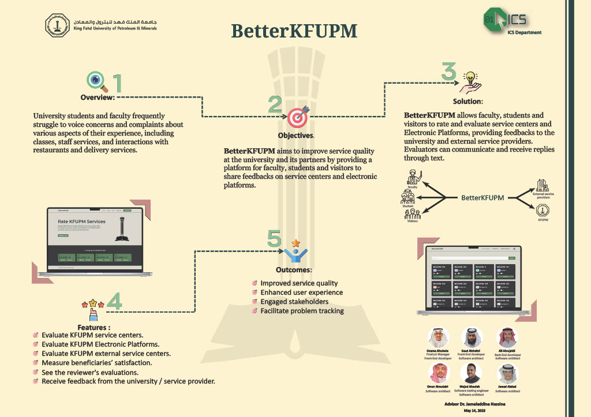

# BetterKFUPM



# This repository contains BetterKFUPM website files which Created by :
> - [Osama Alsubaie](www.linkedin.com/in/osamaalsubaie)
> - [Ali Alnujaidi](https://www.linkedin.com/in/ali-alnujaidi-a903b0268?lipi=urn%3Ali%3Apage%3Ad_flagship3_profile_view_base_project_creator%3B5%2BLjjwcuTgyOXWR6m%2Bo1YA%3D%3D)
> - [Saud Alshehri](https://www.linkedin.com/in/viasaud?lipi=urn%3Ali%3Apage%3Ad_flagship3_profile_view_base_project_creator%3B5%2BLjjwcuTgyOXWR6m%2Bo1YA%3D%3D)
> - [Majed Alsadah](https://www.linkedin.com/in/majed-alsadah?lipi=urn%3Ali%3Apage%3Ad_flagship3_profile_view_base_project_creator%3B5%2BLjjwcuTgyOXWR6m%2Bo1YA%3D%3D)
> - [Omar Almutairi](https://www.linkedin.com/in/omarlinked?lipi=urn%3Ali%3Apage%3Ad_flagship3_profile_view_base_project_creator%3BCch09cPERnOQ6c93icq7Vw%3D%3D)
> - [jawad alalasi](https://www.linkedin.com/in/jawad-alalasi-89b195236/)


# Project Description

BetterKFUPM is an online website that enables KFUPM students, faculty, and visitors to evaluate and provide feedback on KFUPM service centers and Electronic Platforms, with a focus on tracking progress on improvements and fostering the development of these services.

# Techonologies used

## Front-End
>- Tailwind CSS
>- ReactJS
>- Axios

## Back-End
>- NodeJS
>- ExpressJS
>- Supabase
>- JWT


# Repository Structure

> - client : contains the client side files (Front-End).
> - server : contains the server side files (Back-End).

# How to run the project

 - Clone the repository.
- Open the terminal and navigate to the server folder.
- Run the following command to install the required packages.
```bash
npm install
```
- Run the following command to start the server.
```bash
npm run dev
```
- Open the terminal and navigate to the client folder.
- Run the following command to install the required packages.
```bash
npm install
```
- Run the following command to start the client.
```bash
npm run dev
```
- Shift+Click on the appeared link in the client server terminal to open the project in the browser.
